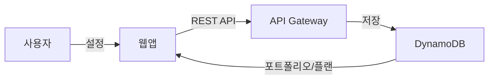
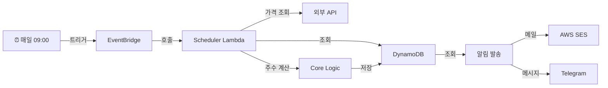

# 📈 Invest-Assist

자동 달러 코스트 애버리징(DCA) 투자 계획 관리 및 실행 플랫폼

## 📋 목차

- [프로젝트 개요](#프로젝트-개요)
- [아키텍처](#아키텍처)
- [프로젝트 구조](#프로젝트-구조)
- [핵심 기능](#핵심-기능)
- [기술 스택](#기술-스택)
- [설치 및 실행](#설치-및-실행)
- [개발 워크플로우](#개발-워크플로우)
- [배포](#배포)

---

## 프로젝트 개요

**Invest-Assist**는 개인 투자자의 포트폴리오 관리와 자동화된 주문 계획 생성을 지원하는 플랫폼입니다.

### 핵심 가치

- 💰 **DCA 전략 자동화**: 월 예산과 매수일 설정으로 매달 자동 주문표 생성
- 📊 **포트폴리오 관리**: 선호하는 종목과 비중을 자유롭게 설정
- 🔔 **스마트 알림**: 매수일에 주문 정보를 이메일/텔레그램으로 발송
- ✅ **실행 추적**: 실제 주문 여부를 확인하고 기록 관리
- 🎯 **신호 제공**: 시장 과열도 표시로 투자 의사결정 지원

### 대상 사용자

- 장기 자산 배분 전략을 추구하는 개인 투자자
- 정기적인 투자 규율을 유지하고 싶은 사용자

---

## 아키텍처

### 시스템 다이어그램

```mermaid
graph TB
    User["👤 사용자<br/>(브라우저)"]
    Frontend["🎨 Frontend<br/>(Vite + React)<br/>Vercel 호스팅"]
    APIGateway["🚪 API Gateway<br/>(AWS)"]
    
    AuthLambda["🔐 Auth Lambda<br/>이메일 매직링크"]
    UserLambda["👥 User Lambda<br/>사용자 설정"]
    PortfolioLambda["📊 Portfolio Lambda<br/>포트폴리오 관리"]
    PlanLambda["📅 Plan Lambda<br/>투자 플랜"]
    ExecutionLambda["💵 Execution Lambda<br/>주문표 관리"]
    SchedulerLambda["⏰ Scheduler Lambda<br/>자동화 엔진"]
    
    DynamoDB["💾 DynamoDB<br/>(users, portfolios,<br/>plans, executions,<br/>price_snapshots)"]
    
    EventBridge["📢 EventBridge<br/>(일일 트리거)"]
    
    PriceAPI["📈 외부 API<br/>(가격 데이터)"]
    
    SES["📧 AWS SES<br/>(이메일)"]
    Telegram["✈️ Telegram<br/>(메시지)"]
    
    CloudWatch["📝 CloudWatch Logs<br/>(감시 & 로깅)"]
    
    User -->|HTTP(S)| Frontend
    Frontend -->|REST API| APIGateway
    
    APIGateway --> AuthLambda
    APIGateway --> UserLambda
    APIGateway --> PortfolioLambda
    APIGateway --> PlanLambda
    APIGateway --> ExecutionLambda
    
    AuthLambda --> DynamoDB
    UserLambda --> DynamoDB
    PortfolioLambda --> DynamoDB
    PlanLambda --> DynamoDB
    ExecutionLambda --> DynamoDB
    
    EventBridge -->|매일 09:00| SchedulerLambda
    SchedulerLambda --> PriceAPI
    SchedulerLambda --> DynamoDB
    SchedulerLambda --> SES
    SchedulerLambda --> Telegram
    
    AuthLambda --> CloudWatch
    SchedulerLambda --> CloudWatch
    ExecutionLambda --> CloudWatch
```

### 데이터 흐름

#### A) 사용자 설정 흐름


#### B) 자동화 실행 흐름 (매수일)


#### C) 사용자 주문 확인 흐름


---

## 프로젝트 구조

```
invest-project/
├── apps/
│   └── web/                          # 📱 React 프론트엔드 (Vite)
│       ├── src/
│       │   ├── app/                  # 앱 진입점 & 공급자
│       │   ├── entities/             # 도메인 모델 (Portfolio, Plan, Execution, User, Ticker)
│       │   │   ├── portfolio/        # 포트폴리오 엔티티
│       │   │   ├── plan/             # 투자 플랜 엔티티
│       │   │   ├── execution/        # 주문표 엔티티
│       │   │   ├── user/             # 사용자 엔티티
│       │   │   └── ticker/           # 종목 엔티티
│       │   ├── features/             # 기능 (UseCase)
│       │   │   ├── auth/             # 로그인/로그아웃
│       │   │   ├── portfolio/        # 포트폴리오 편집
│       │   │   ├── plan/             # 플랜 편집
│       │   │   ├── execution/        # 주문 확인
│       │   │   └── scheduler/        # 스케줄 트리거
│       │   ├── pages/                # 페이지 컴포넌트
│       │   │   ├── auth-callback/    # 로그인 콜백
│       │   │   ├── dashboard/        # 대시보드
│       │   │   ├── execution/        # 주문표 조회
│       │   │   ├── onboarding/       # 초기 설정
│       │   │   ├── settings*/        # 설정 페이지들
│       │   │   └── ...
│       │   ├── widgets/              # 재사용 가능한 UI 컴포넌트
│       │   │   ├── dashboard-summary/
│       │   │   ├── execution-table/
│       │   │   └── settings-panel/
│       │   ├── shared/               # 공유 리소스
│       │   │   ├── api/              # API 호출 유틸
│       │   │   ├── config/           # 설정
│       │   │   ├── i18n/             # 국제화
│       │   │   ├── lib/              # 유틸리티 함수
│       │   │   ├── types/            # 공유 타입 정의
│       │   │   └── ui/               # 기본 UI 컴포넌트
│       │   ├── processes/            # 비즈니스 프로세스
│       │   │   └── auth/             # 인증 플로우
│       │   └── routes/               # 라우팅 정의
│       └── package.json
│
├── services/
│   └── api/                          # 🔌 AWS Lambda API (Node.js)
│       ├── src/
│       │   ├── modules/              # Lambda 함수들
│       │   │   ├── auth/             # 인증 엔드포인트
│       │   │   ├── user/             # 사용자 엔드포인트
│       │   │   ├── portfolio/        # 포트폴리오 엔드포인트
│       │   │   ├── plan/             # 플랜 엔드포인트
│       │   │   ├── execution/        # 주문표 엔드포인트
│       │   │   ├── scheduler/        # 스케줄 자동화
│       │   │   └── ticker/           # 종목 데이터
│       │   ├── shared/               # 공유 유틸
│       │   │   ├── db.ts             # DynamoDB 클라이언트
│       │   │   ├── jwt.ts            # JWT 토큰 처리
│       │   │   ├── response.ts        # 응답 포맷터
│       │   │   ├── logger.ts          # 로깅
│       │   │   ├── crypto.ts          # 암호화
│       │   │   ├── config.ts          # 환경 설정
│       │   │   ├── secrets.ts         # Secrets Manager
│       │   │   └── middleware/        # Express 미들웨어
│       │   └── index.ts              # 진입점
│       └── package.json
│
├── packages/
│   └── core/                         # ⚙️ 공유 비즈니스 로직
│       ├── src/
│       │   ├── calc/                 # 핵심 계산 로직
│       │   │   ├── calculateExecution.ts  # 주문수량 계산
│       │   │   ├── validators.ts          # 데이터 검증
│       │   │   └── types.ts               # 계산 타입
│       │   └── models/               # 공유 데이터 모델
│       │       ├── execution.ts
│       │       ├── plan.ts
│       │       └── portfolio.ts
│       └── package.json
│
├── docs/                             # 📚 문서
│   ├── architecture.md               # 시스템 아키텍처
│   ├── mvp.md                        # MVP 범위
│   ├── authentication.md             # 인증 상세
│   ├── schema.md                     # 데이터베이스 스키마
│   ├── calc.md                       # 계산 로직 설명
│   ├── scheduler.md                  # 스케줄러 동작
│   ├── deployment.md                 # 배포 가이드
│   ├── testing.md                    # 테스트 전략
│   └── ...
│
├── package.json                      # Monorepo 설정 (pnpm)
├── pnpm-workspace.yaml               # Workspace 정의
└── CLAUDE.md                         # AI 개발 가이드라인
```

---

## 핵심 기능

### 1️⃣ 사용자 인증
- **이메일 매직링크**: 패스워드 없는 인증
- **JWT 토큰**: Access + Refresh 쌍 기반 세션
- **보안**: CORS, CSRF 방지

### 2️⃣ 포트폴리오 설정
- 투자 종목 선정 (미국 주식, ETF 등)
- 각 종목별 목표 비중 설정
- 언제든 수정 가능

### 3️⃣ 투자 플랜
- 월 투자 예산 설정
- 매수일 지정 (예: 매월 15일)
- 분할 매수 계획 (1회 vs 2~3회)

### 4️⃣ 주문표 자동 생성 (Scheduler)
매수일마다 자동으로:
- 🔍 현재 시장가 조회
- 📐 각 종목별 권장 주수 계산
- 💾 주문표 저장
- 📧 사용자에게 알림

### 5️⃣ 신호 및 분석
- **과열 지수**: 최근 RSI 등을 통한 시장 상태 표시
- **가격 캐시**: 재현성 및 비용 효율화

### 6️⃣ 주문 확인 (Confirm)
- 실제 주문 완료 후 "확인" 버튼 클릭
- 간단 메모 추가 가능
- 상태 추적: PENDING → CONFIRMED

---

## 기술 스택

### Frontend
| 항목 | 기술 |
|------|------|
| 프레임워크 | React 18 |
| 빌드 도구 | Vite |
| 상태 관리 | Zustand |
| 데이터 페칭 | TanStack React Query v5 |
| 라우팅 | React Router v6 |
| 스타일 | Tailwind CSS |
| i18n | i18next |
| 배포 | Vercel |

### Backend
| 항목 | 기술 |
|------|------|
| 런타임 | Node.js 20+ |
| 서버리스 | AWS Lambda |
| API | API Gateway (REST) |
| 데이터베이스 | DynamoDB |
| 스케줄링 | EventBridge |
| 알림 | AWS SES, Telegram API |
| 인증 | JWT (jose) |
| 로깅 | CloudWatch |

### 공유 패키지
| 항목 | 기술 |
|------|------|
| 패키지 관리자 | pnpm |
| 언어 | TypeScript 5 |
| 모노레포 | pnpm workspace |
| 테스트 | Vitest |
| 린트 | ESLint + TypeScript |

---

## 설치 및 실행

### 사전 요구사항
- **Node.js**: 20.0.0 이상
- **pnpm**: 8.0.0 이상
- **AWS 계정**: Lambda, DynamoDB, API Gateway 배포용
- **환경 변수**: `.env` 파일 (서비스별)

### 전체 설치

```bash
# 1. 저장소 클론
git clone https://github.com/yourusername/invest-project.git
cd invest-project

# 2. 의존성 설치
pnpm install

# 3. 타입 체크 (필수)
pnpm typecheck

# 4. 린트 실행
pnpm lint
```

### 개발 환경 실행

#### Frontend만 실행
```bash
pnpm dev:web
```
- URL: `http://localhost:5173`

#### Backend (Local)만 실행
```bash
pnpm dev:api
```
또는
```bash
cd services/api
pnpm start:local
```
- API: `http://localhost:3000`

#### 전체 개발 (병렬)
```bash
# 터미널 1
pnpm dev:web

# 터미널 2
pnpm dev:api
```

### 테스트 실행

```bash
# 전체 테스트
pnpm test

# Core 패키지만 테스트
pnpm test:core

# Watch 모드
cd packages/core
pnpm test:watch
```

### 빌드

```bash
# 전체 프로젝트 빌드
pnpm build

# 특정 패키지만 빌드
pnpm --filter @invest-assist/web build
pnpm --filter @invest-assist/api build
pnpm --filter @invest-assist/core build
```

---

## 개발 워크플로우

### 1. 브랜치 생성
```bash
git checkout -b <type>/<description>
# 예: feat/add-execution-confirm, fix/scheduler-timeout
```

타입: `feat`, `fix`, `refactor`, `docs`, `chore`

### 2. 코드 작성 후 필수 체크

#### ✅ 타입 체크 (필수)
```bash
# 전체
pnpm typecheck

# 또는 개별
cd services/api && pnpm tsc --noEmit
cd apps/web && pnpm tsc --noEmit
cd packages/core && pnpm tsc --noEmit
```

#### ✅ 린트 체크
```bash
pnpm lint
```

#### ✅ 테스트 실행
```bash
pnpm test
```

### 3. 커밋 및 푸시

```bash
git add .
git commit -m "feat: add execution confirmation feature"
git push origin <branch-name>
```

**커밋 메시지**: [Conventional Commits](https://www.conventionalcommits.org/) 형식 사용

### 4. Pull Request & Merge
- PR 작성 후 코드 리뷰
- CI 검증 통과 후 main에 merge

### ⚠️ 자주 놓치는 실수

| 실수 | 원인 | 해결책 |
|------|------|--------|
| 타입 에러로 빌드 실패 | 타입 체크 미실행 | 커밋 전 `pnpm typecheck` 실행 |
| 사용하지 않는 변수 | `noUnusedLocals` 설정 | 제거 또는 `_variable` 접두사 사용 |
| CORS 에러 | 응답에 CORS 헤더 미포함 | `createResponder()` 사용 |
| 환경 변수 누락 | `.env` 미설정 | 각 서비스 `.env.example` 참고 |

---

## 배포

### 자동 배포

**Vercel** (Frontend)
- `apps/web/**` 변경 시 자동 배포
- 브랜치 배포 & Preview

**GitHub Actions + AWS** (Backend)
- `services/api/**` 변경 시 Lambda 자동 배포
- CloudFormation (SAM) 기반

### 수동 배포

#### Frontend
```bash
cd apps/web
pnpm build
# vercel CLI로 배포
vercel deploy --prod
```

#### Backend
```bash
cd services/api
pnpm build
# AWS SAM으로 배포
sam deploy --guided
```

자세한 배포 가이드: [배포 문서](./docs/deployment.md)

---

## 문서

주요 문서는 `docs/` 디렉토리에 있습니다:

- 📐 [아키텍처](./docs/architecture.md) - 시스템 설계
- 📋 [MVP 범위](./docs/mvp.md) - 기능 우선순위
- 🔐 [인증](./docs/authentication.md) - 보안 플로우
- 💾 [스키마](./docs/schema.md) - 데이터베이스 구조
- 🧮 [계산 로직](./docs/calc.md) - 주수 계산 알고리즘
- ⏰ [스케줄러](./docs/scheduler.md) - 자동화 엔진
- 🚀 [배포](./docs/deployment.md) - 배포 가이드
- 🧪 [테스트](./docs/testing.md) - 테스트 전략
- 🤖 [AI 가이드](./CLAUDE.md) - AI 개발 지침

---

## 라이센스

MIT License - 자유롭게 사용, 수정, 배포 가능

---

## 연락 및 지원

- 🐛 버그 리포트: [GitHub Issues](https://github.com/yourusername/invest-project/issues)
- 💬 토론: [GitHub Discussions](https://github.com/yourusername/invest-project/discussions)
- 📧 이메일: your.email@example.com

---

## 기여하기

이 프로젝트에 기여하려면:

1. Fork 저장소
2. Feature 브랜치 생성 (`git checkout -b feat/amazing-feature`)
3. 변경사항 커밋 (`git commit -m 'Add amazing feature'`)
4. 브랜치 Push (`git push origin feat/amazing-feature`)
5. Pull Request 생성

기여 가이드: [CONTRIBUTING.md](./docs/contributing.md) (예정)

---

## 로드맵

### ✅ MVP (진행 중)
- [x] 기본 인증
- [x] 포트폴리오/플랜 설정
- [x] 주문표 자동 생성
- [ ] 알림 발송 (진행 중)
- [ ] 주문 확인

### 🔮 v0.2
- [ ] 신호 고도화 (RSI + MA)
- [ ] 텔레그램 알림
- [ ] 가격 캐시 최적화

### 🚀 v1.0
- [ ] AI 코멘트 (온디맨드)
- [ ] 리포트 스냅샷
- [ ] 다국적 시장 지원

---

**Happy Investing! 🚀**
